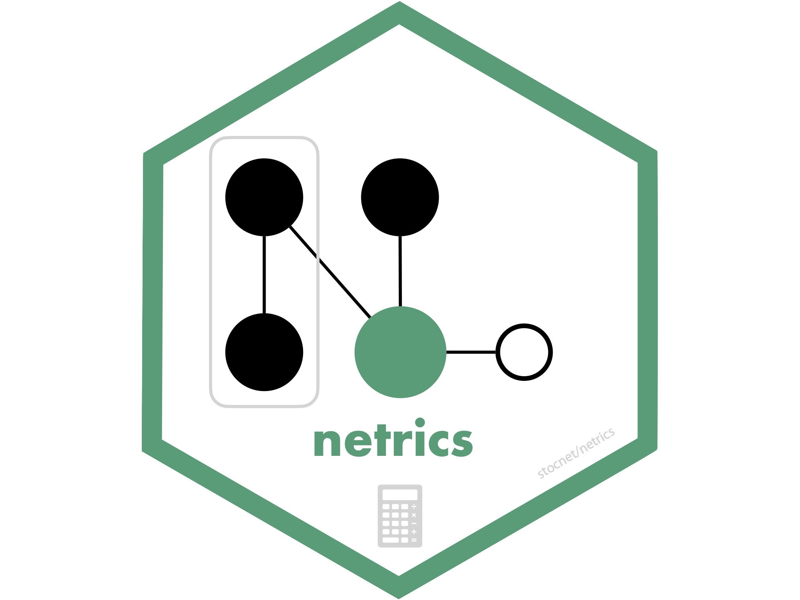

<!-- README.md is generated from README.Rmd. Please edit that file -->

# netrics

<!-- badges: start -->

  

<!-- badges: end -->

## About the package

`{netrics}` is the analytic engine of the
[stocnet](https://github.com/stocnet) ecosystem. It provides *many*
tools for marking, measuring, and identifying nodes’ motifs and
memberships in *many* (if not most) types and kinds of networks. All
functions operate on matrices, `{igraph}`, `{network}`, `{tidygraph}`,
and `mnet` class objects, and recognise directed, weighted, multiplex,
multimodal, signed, and other types of networks.

`{netrics}` depends on
[`{manynet}`](https://stocnet.github.io/manynet/), which handles working
with different network classes, converting between them, and modifying
them. Network-level logical tests (e.g. `is_directed()`, `is_twomode()`)
remain in `{manynet}`, while node- and tie-level analytic marks
(e.g. `node_is_*()`, `tie_is_*()`) are in `{netrics}`. For graph
drawing, see [`{autograph}`](https://stocnet.github.io/autograph/), and
for further testing and modelling capabilities see
[`{migraph}`](https://stocnet.github.io/migraph/).

- [Marking](#marking)
- [Measures](#measures)
- [Memberships](#memberships)
- [Motifs](#motifs)
- [Analysis](#analysis)
- [Installation](#installation)
  - [Stable](#stable)
  - [Development](#development)
- [Relationship to other packages](#relationship-to-other-packages)
- [Funding details](#funding-details)

## Marking

`{netrics}` includes four special groups of functions, each with their
own pretty `print()` and `plot()` methods: marks, measures, motifs, and
memberships. Marks are logical scalars or vectors, measures are numeric,
memberships categorical, and motifs result in tabular outputs.

`{netrics}`’s `node_is_*()` and `tie_is_*()` functions offer fast
logical tests of node- and tie-level properties. `node_is_*()` returns a
logical vector the length of the number of nodes in the network, and
`tie_is_*()` returns a logical vector the length of the number of ties
in the network. Note that network-level tests such as `is_directed()`
and `is_twomode()` are in `{manynet}`.

- `node_is_core()`, `node_is_cutpoint()`, `node_is_exposed()`,
  `node_is_fold()`, `node_is_independent()`, `node_is_infected()`,
  `node_is_isolate()`, `node_is_latent()`, `node_is_max()`,
  `node_is_mean()`, `node_is_mentor()`, `node_is_min()`,
  `node_is_neighbor()`, `node_is_pendant()`, `node_is_random()`,
  `node_is_recovered()`, `node_is_universal()`
- `tie_is_bridge()`, `tie_is_cyclical()`, `tie_is_feedback()`,
  `tie_is_imbalanced()`, `tie_is_loop()`, `tie_is_max()`,
  `tie_is_min()`, `tie_is_multiple()`, `tie_is_path()`,
  `tie_is_random()`, `tie_is_reciprocated()`, `tie_is_simmelian()`,
  `tie_is_transitive()`, `tie_is_triangular()`, `tie_is_triplet()`

The `*is_max()` and `*is_min()` functions are used to identify the
maximum or minimum, respectively, node or tie according to some measure
(see below).

## Measures

`{netrics}`’s `*_by_*()` functions offer numeric measures at the
network, node, and tie level. These include:

- `net_by_adhesion()`, `net_by_assortativity()`, `net_by_balance()`,
  `net_by_betweenness()`, `net_by_closeness()`, `net_by_cohesion()`,
  `net_by_components()`, `net_by_congruency()`,
  `net_by_connectedness()`, `net_by_core()`, `net_by_degree()`,
  `net_by_density()`, `net_by_diameter()`, `net_by_diversity()`,
  `net_by_efficiency()`, `net_by_eigenvector()`, `net_by_equivalency()`,
  `net_by_factions()`, `net_by_harmonic()`, `net_by_heterophily()`,
  `net_by_homophily()`, `net_by_immunity()`, `net_by_indegree()`,
  `net_by_independence()`, `net_by_infection_complete()`,
  `net_by_infection_peak()`, `net_by_infection_total()`,
  `net_by_length()`, `net_by_modularity()`, `net_by_outdegree()`,
  `net_by_reach()`, `net_by_reciprocity()`, `net_by_recovery()`,
  `net_by_reproduction()`, `net_by_richclub()`, `net_by_richness()`,
  `net_by_scalefree()`, `net_by_smallworld()`, `net_by_spatial()`,
  `net_by_strength()`, `net_by_toughness()`, `net_by_transitivity()`,
  `net_by_transmissibility()`, `net_by_upperbound()`, `net_by_waves()`,
  `node_by_adopt_threshold()`, `node_by_adopt_time()`,
  `node_by_alpha()`, `node_by_authority()`, `node_by_betweenness()`,
  `node_by_bridges()`, `node_by_brokering_activity()`,
  `node_by_brokering_exclusivity()`, `node_by_closeness()`,
  `node_by_constraint()`, `node_by_coreness()`, `node_by_deg()`,
  `node_by_degree()`, `node_by_distance()`, `node_by_diversity()`,
  `node_by_eccentricity()`, `node_by_efficiency()`, `node_by_effsize()`,
  `node_by_eigenvector()`, `node_by_equivalency()`,
  `node_by_exposure()`, `node_by_flow()`, `node_by_harmonic()`,
  `node_by_heterophily()`, `node_by_hierarchy()`, `node_by_homophily()`,
  `node_by_hub()`, `node_by_indegree()`, `node_by_induced()`,
  `node_by_information()`, `node_by_kcoreness()`, `node_by_leverage()`,
  `node_by_multidegree()`, `node_by_neighbours_degree()`,
  `node_by_outdegree()`, `node_by_pagerank()`, `node_by_posneg()`,
  `node_by_power()`, `node_by_randomwalk()`, `node_by_reach()`,
  `node_by_reciprocity()`, `node_by_recovery()`, `node_by_redundancy()`,
  `node_by_richness()`, `node_by_stress()`, `node_by_subgraph()`,
  `node_by_transitivity()`, `node_by_vitality()`,
  `tie_by_betweenness()`, `tie_by_closeness()`, `tie_by_cohesion()`,
  `tie_by_degree()`, `tie_by_eigenvector()`

The measures are organised into several broad categories, including:
*Centrality*, *Cohesion*, *Hierarchy*, *Innovation* (structural holes),
*Diversity* (heterogeneity), *Topology* (features), and *Diffusion*.
Each measure recognises whether the network is directed or undirected,
weighted or unweighted, one-mode or two-mode, and returns normalized
values wherever possible. We recommend you explore [the list of
functions](https://stocnet.github.io/netrics/reference/index.html) to
find out more.

## Memberships

`{netrics}`‘s `*_in_*()` functions identify nodes’ membership in some
grouping, such as a community or component. These functions always
return a character vector, indicating e.g. that the first node is a
member of group “A”, the second in group “B”, etc.

- `node_in_adopter()`, `node_in_automorphic()`, `node_in_betweenness()`,
  `node_in_brokering()`, `node_in_community()`, `node_in_component()`,
  `node_in_core()`, `node_in_eigen()`, `node_in_equivalence()`,
  `node_in_fluid()`, `node_in_greedy()`, `node_in_infomap()`,
  `node_in_leiden()`, `node_in_louvain()`, `node_in_optimal()`,
  `node_in_partition()`, `node_in_regular()`, `node_in_roulette()`,
  `node_in_spinglass()`, `node_in_strong()`, `node_in_structural()`,
  `node_in_walktrap()`, `node_in_weak()`

For example `node_in_brokering()` returns the frequency of nodes’
participation in Gould-Fernandez brokerage roles for a one-mode network,
and the Jasny-Lubell brokerage roles for a two-mode network.

These can be analysed alone, or used as a profile for establishing
equivalence. `{netrics}` offers both HCA and CONCOR algorithms, as well
as elbow, silhouette, and strict methods for *k*-cluster selection.

`{netrics}` also includes functions for establishing membership on other
bases, such as typical community detection algorithms, as well as
component and core-periphery partitioning algorithms.

## Motifs

`{netrics}`‘s `*_x_*()` functions tabulate nodes’ and networks’
frequency in various motifs. These include:

- `net_x_brokerage()`, `net_x_change()`, `net_x_correlation()`,
  `net_x_dyad()`, `net_x_hazard()`, `net_x_hierarchy()`,
  `net_x_mixed()`, `net_x_stability()`, `net_x_tetrad()`,
  `net_x_triad()`, `node_x_brokerage()`, `node_x_dyad()`,
  `node_x_exposure()`, `node_x_path()`, `node_x_tetrad()`,
  `node_x_tie()`, `node_x_triad()`

## Analysis

The functions in `{netrics}` are designed to answer a wide variety of
analytic questions about networks. For example, you might want to know
about:

- *Centrality*: `net_by_betweenness()`, `net_by_closeness()`,
  `net_by_degree()`, `net_by_eigenvector()`, `net_by_indegree()`,
  `net_by_outdegree()`, `node_by_betweenness()`, `node_by_closeness()`,
  `node_by_degree()`, `node_by_eigenvector()`, `node_by_indegree()`,
  `node_by_multidegree()`, `node_by_neighbours_degree()`,
  `node_by_outdegree()`, `node_in_betweenness()`,
  `tie_by_betweenness()`, `tie_by_closeness()`, `tie_by_degree()`,
  `tie_by_eigenvector()`
- *Cohesion*: `net_by_congruency()`, `net_by_density()`,
  `net_by_equivalency()`, `net_by_reciprocity()`,
  `net_by_transitivity()`, `node_by_equivalency()`,
  `node_by_reciprocity()`, `node_by_transitivity()`
- *Hierarchy*: `net_by_connectedness()`, `net_by_efficiency()`,
  `net_by_reciprocity()`, `net_by_upperbound()`, `net_x_hierarchy()`,
  `node_by_efficiency()`, `node_by_hierarchy()`, `node_by_reciprocity()`
- *Topology*: `net_by_balance()`, `net_by_core()`, `net_by_factions()`,
  `net_by_modularity()`, `net_by_richclub()`, `net_by_smallworld()`,
  `node_by_coreness()`, `node_by_kcoreness()`, `node_in_core()`,
  `node_is_core()`, `tie_is_imbalanced()`
- *Resilience*: `net_by_adhesion()`, `net_by_cohesion()`,
  `node_by_bridges()`, `node_is_cutpoint()`, `tie_by_cohesion()`,
  `tie_is_bridge()`
- *Brokerage*: `net_x_brokerage()`, `node_by_brokering_activity()`,
  `node_by_brokering_exclusivity()`, `node_by_constraint()`,
  `node_by_effsize()`, `node_by_redundancy()`, `node_in_brokering()`,
  `node_x_brokerage()`
- *Diversity*: `net_by_assortativity()`, `net_by_diversity()`,
  `net_by_heterophily()`, `net_by_homophily()`, `net_by_richness()`,
  `node_by_diversity()`, `node_by_heterophily()`, `node_by_homophily()`,
  `node_by_richness()`
- *Diffusion*: `net_by_infection_complete()`, `net_by_infection_peak()`,
  `net_by_infection_total()`, `node_by_adopt_threshold()`,
  `node_by_adopt_time()`, `node_by_exposure()`, `node_in_adopter()`,
  `node_is_exposed()`, `node_is_infected()`, `node_x_exposure()`

## Installation

### Stable

The easiest way to install the latest stable version of `{netrics}` is
via CRAN. Simply open the R console and enter:

`install.packages('netrics')`

`library(netrics)` will then load the package and make the functions
contained within the package available.

### Development

For the latest development version, for slightly earlier access to new
features or for testing, you may wish to download and install the
binaries from Github or install from source locally. The latest binary
releases for all major OSes – Windows, Mac, and Linux – can be found
[here](https://github.com/stocnet/netrics/releases/latest). Download the
appropriate binary for your operating system, and install using an
adapted version of the following commands:

- For Windows:
  `install.packages("~/Downloads/netrics_winOS.zip", repos = NULL)`
- For Mac:
  `install.packages("~/Downloads/netrics_macOS.tgz", repos = NULL)`
- For Unix:
  `install.packages("~/Downloads/netrics_linuxOS.tar.gz", repos = NULL)`

To install from source the latest main version of `{netrics}` from
Github, please install the `{remotes}` package from CRAN and then:

- For latest stable version:
  `remotes::install_github("stocnet/netrics")`
- For latest development version:
  `remotes::install_github("stocnet/netrics@develop")`

### Other sources

Those using Mac computers may also install using Macports:

`sudo port install R-netrics`

## Relationship to other packages

`{netrics}` is part of the [stocnet](https://github.com/stocnet)
ecosystem of R packages for network analysis. The packages are designed
to be modular, with clear roles and dependencies:

- [`{manynet}`](https://stocnet.github.io/manynet/): The foundation
  package for working with network data. It handles network classes
  (matrices, `{igraph}`, `{network}`, `{tidygraph}`, `mnet`), coercion
  between them, modification, and network-level logical tests (`is_*()`
  functions).
- **`{netrics}`**: The analytic package containing all measures
  (`*_by_*()` functions), memberships (`*_in_*()` functions), motifs
  (`*_x_*()` functions), and node- and tie-level marks (`node_is_*()`,
  `tie_is_*()` functions). `{netrics}` depends on `{manynet}`.
- [`{autograph}`](https://stocnet.github.io/autograph/): The graph
  drawing package. `{autograph}` depends on both `{manynet}` (for
  network classes) and `{netrics}` (for analytic results to visualise),
  since it would typically be used with both.
- [`{migraph}`](https://stocnet.github.io/migraph/): The modelling and
  testing package, building on both `{manynet}` and `{netrics}`.

Node- and tie-level marks such as `node_is_cutpoint()` and
`tie_is_bridge()` are kept in `{netrics}` rather than `{manynet}`
because they are analytic functions that identify structural positions
in the network. Network-level property tests like `is_directed()` remain
in `{manynet}` because they describe the type of data rather than an
analytic result.

## Funding details

Development on this package has been funded by the Swiss National
Science Foundation (SNSF) [Grant Number
188976](https://data.snf.ch/grants/grant/188976): “Power and Networks
and the Rate of Change in Institutional Complexes” (PANARCHIC).
